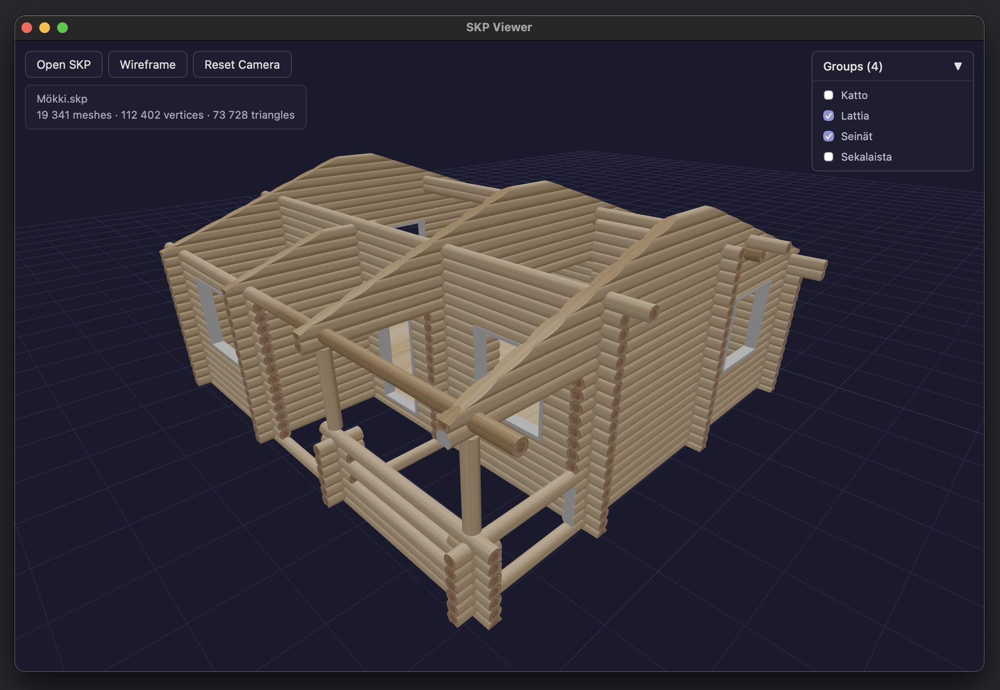

# SKP Viewer

A macOS app for viewing SketchUp (.skp) 3D model files.



## Setup

Requires macOS, [Bun](https://bun.sh/), and the [SketchUp SDK](https://extensions.sketchup.com/sketchup-sdk) extracted to `resources/sdk/SketchUpAPI.framework`.

```bash
bun install
bun dev
```

To build and install to `/Applications`:

```bash
bun install:app
```
