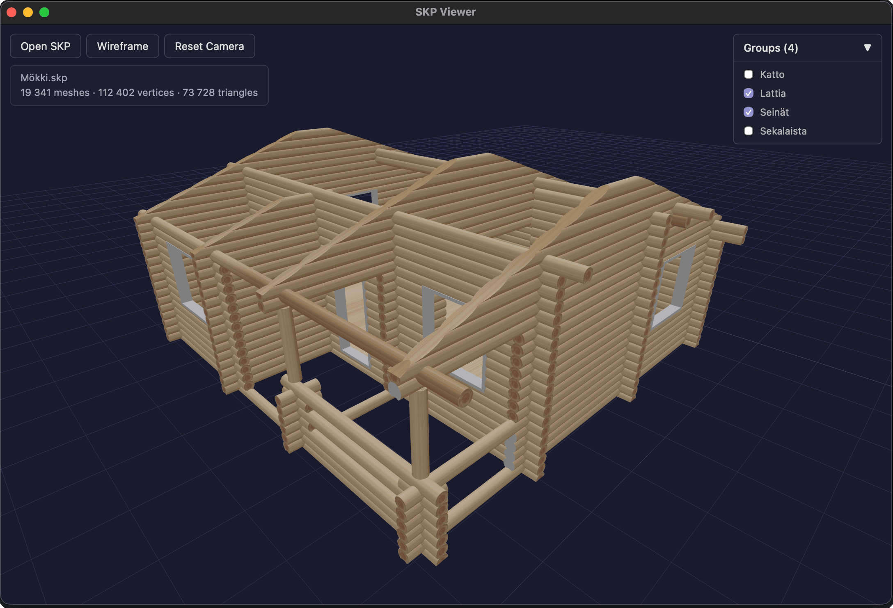

# &ensp;SKP Viewer

A macOS app for viewing SketchUp (.skp) 3D model files.



## Setup

Requires macOS, [Bun](https://bun.sh/), [Homebrew](https://brew.sh/), the Xcode Command Line Tools (`xcode-select --install`), and the [SketchUp SDK](https://extensions.sketchup.com/sketchup-sdk) extracted to `resources/sdk/SketchUpAPI.framework`.

```bash
bun install
bun dev       # build the native bridge and run the app
```

To build and install to `/Applications`:

```bash
brew install openssl   # one-time
bun cert --create      # one-time: create a self-signed code-signing cert
bun install:app        # build, sign, and copy to /Applications
```

To remove the installed app, its data and its permission grants:

```bash
bun reset:install
```
